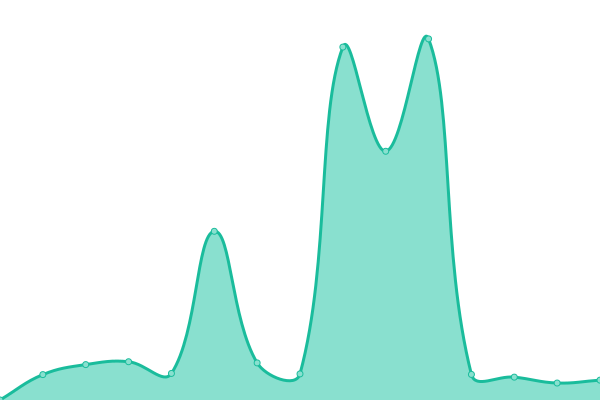
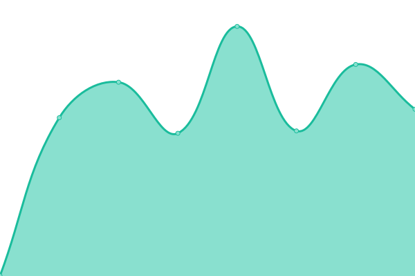
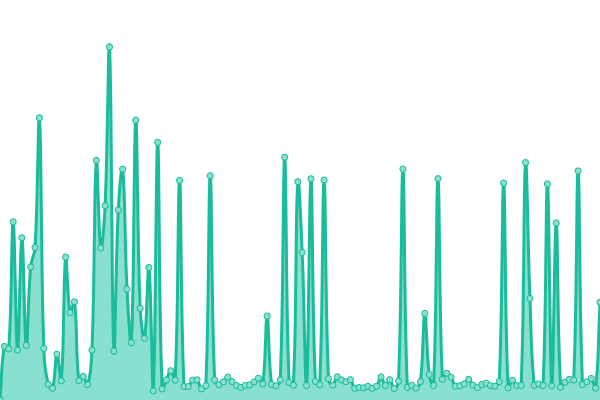
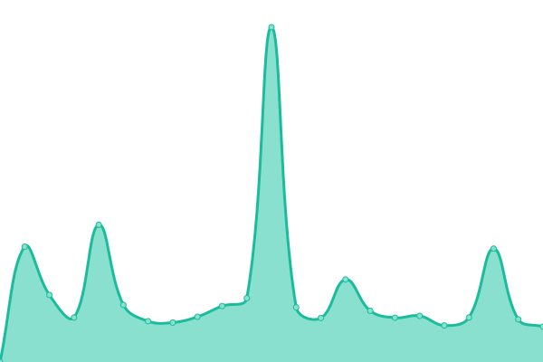

# [📈 Live Status](https://status.delta-core.fr): <!--live status--> **🟩 All systems operational**

This repository contains the open-source uptime monitor and status page for [Delta Core développement ](https://delta-core.fr), powered by [Upptime](https://github.com/upptime/upptime).

With [Upptime](https://upptime.js.org), you can get your own unlimited and free uptime monitor and status page, powered entirely by a GitHub repository. We use [Issues](https://github.com/Delta-Core/status/issues) as incident reports, [Actions](https://github.com/Delta-Core/status/actions) as uptime monitors, and [Pages](https://status.delta-core.fr) for the status page.

<!--start: status pages-->
<!-- This summary is generated by Upptime (https://github.com/upptime/upptime) -->
<!-- Do not edit this manually, your changes will be overwritten -->
<!-- prettier-ignore -->
| URL | Status | History | Response Time | Uptime |
| --- | ------ | ------- | ------------- | ------ |
|  [VoIP](voip.delta-core.app) | 🟩 Up | [vo-ip.yml](https://github.com/Delta-Core/status/commits/HEAD/history/vo-ip.yml) | 

 1233ms
     
 | 

<a href="https://status.delta-core.fr/history/vo-ip">85.96%</a>
    

|  [Site Vitrine](https://delta-core.fr) | 🟩 Up | [site-vitrine.yml](https://github.com/Delta-Core/status/commits/HEAD/history/site-vitrine.yml) | 

 878ms
     
 | 

<a href="https://status.delta-core.fr/history/site-vitrine">85.97%</a>
    

|  [cPanel](https://charlie.delta-core.fr) | 🟩 Up | [c-panel.yml](https://github.com/Delta-Core/status/commits/HEAD/history/c-panel.yml) | 

 454ms
     
 | 

<a href="https://status.delta-core.fr/history/c-panel">85.98%</a>
    

|  [Plesk](https://romain.delta-core.fr) | 🟩 Up | [plesk.yml](https://github.com/Delta-Core/status/commits/HEAD/history/plesk.yml) | 

 2500ms
     
 | 

<a href="https://status.delta-core.fr/history/plesk">86.00%</a>
    

<!--end: status pages-->

[**Visit our status website →**](https://status.delta-core.fr)

## 📄 License

- Powered by: [Upptime](https://github.com/upptime/upptime)
- Code: [MIT](./LICENSE) © [Delta Core développement ](https://delta-core.fr)
- Data in the `./history` directory: [Open Database License](https://opendatacommons.org/licenses/odbl/1-0/)
